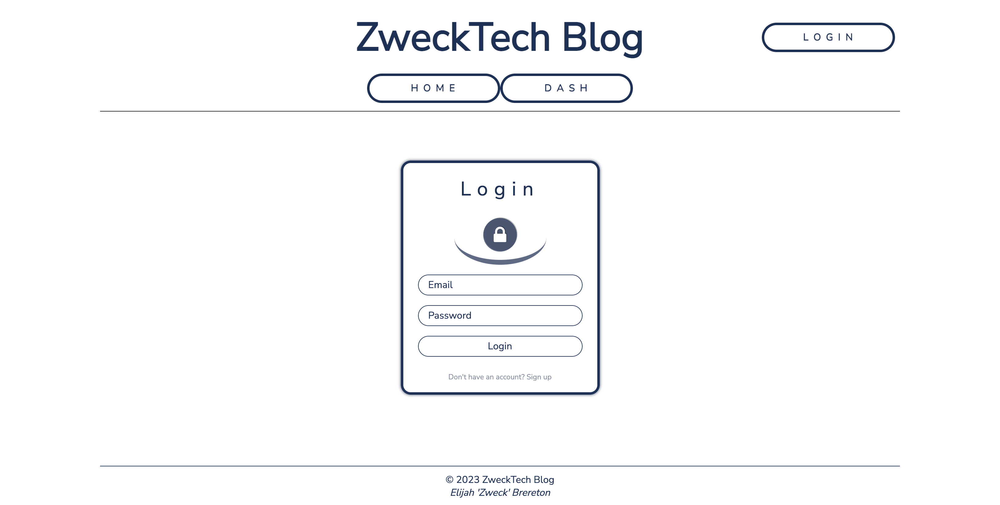
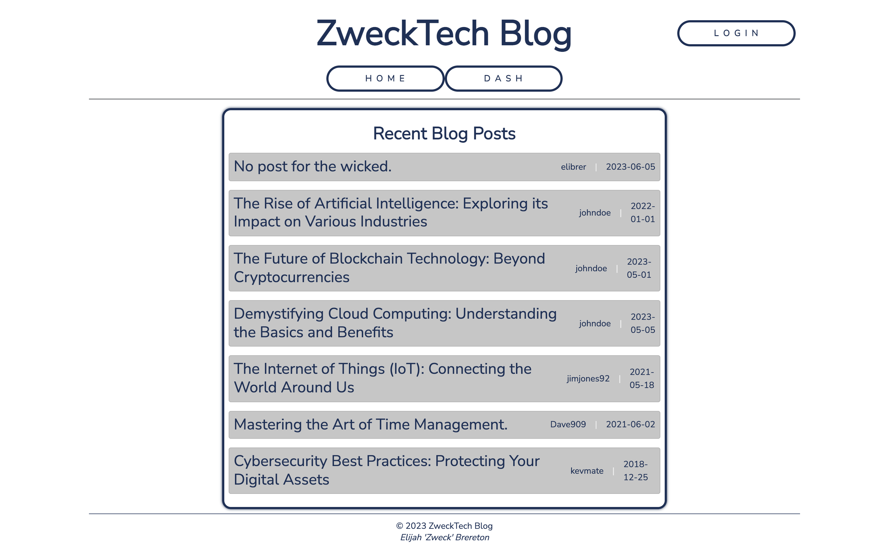
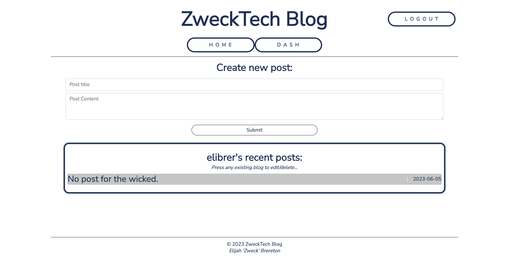

## ZweckTech Blog by Elibrer 


*This web page can be used to create new blog posts to share with other users, while giving the user the ablity to comment on other posts*

---

## Languages used
  [](https://www.mysql.com/)  

   [](https://expressjs.com/)  

---

## Links
> - [GitHub Repository](https://github.com/elibrer/online-tech-blog)
> 
> - [Link to deployed application](https://zweck-tech-blog.herokuapp.com/)

---

## Contributors
> Elijah Brereton @[GitHub](https://github.com/elibrer)

---

## Table of Contents
- [Description](#description)
- [Installation](#installation)
- [Features](#features)
- [Documentation](#documentation)
- [Application Preview](#application-preview)
- [License](#license)
- [Tests](#tests)
- [Questions](#questions)

---

## Description
If you ever felt the need to share your thoughts to the wider population, then this blog site is for you. The user is able to create their own blog posts, for anyone online to see. Futher, any registered user may then share comments and interact with the posts, building an online community of like minded people!

---

## Installation
For usage of this application, visit the Note Taker website via heroku. No further installation is required to access and operate the application.

---

## Features
```
- WHEN I visit the site for the first time
- THEN I am presented with the homepage, which includes existing blog posts if any have been posted; navigation links for the homepage and the dashboard; and the option to log in
- WHEN I click on the homepage option
- THEN I am taken to the homepage
- WHEN I click on any other links in the navigation
- THEN I am prompted to either sign up or sign in
- WHEN I choose to sign up
- THEN I am prompted to create a username and password
- WHEN I click on the sign-up button
- THEN my user credentials are saved and I am logged into the site
- WHEN I revisit the site at a later time and choose to sign in
- THEN I am prompted to enter my username and password
- WHEN I am signed in to the site
- THEN I see navigation links for the homepage, the dashboard, and the option to log out
- WHEN I click on the homepage option in the navigation
- THEN I am taken to the homepage and presented with existing blog posts that include the post title and the date created
- WHEN I click on an existing blog post
-THEN I am presented with the post title, contents, post creator’s username, and date created for that post and have the option to leave a comment
- WHEN I enter a comment and click on the submit button while signed in
-THEN the comment is saved and the post is updated to display the comment, the comment creator’s username, and the date created
- WHEN I click on the dashboard option in the navigation
- THEN I am taken to the dashboard and presented with any blog posts I have already created and the option to add a new blog post
- WHEN I click on the button to add a new blog post
- THEN I am prompted to enter both a title and contents for my blog post
- WHEN I click on the button to create a new blog post
- THEN the title and contents of my post are saved and I am taken back to an updated dashboard with my new blog post
- WHEN I click on one of my existing posts in the dashboard
- THEN I am able to delete or update my post and taken back to an updated dashboard
- WHEN I click on the logout option in the navigation
- THEN I am signed out of the site
- WHEN I am idle on the site for more than a set time
- THEN I am able to view comments but I am prompted to log in again before I can add, update, or delete comments
```

---

## Documentation
No documentation provided.

---

## Application Preview
### `Login Page`

### `Home Page`

### `Dashboard`


---

## License
[Licensed under the MIT license.](https://opensource.org/licenses/MIT)

---

## Tests
To test, simply run the application by using the instructions provided above. If there are any errors, or the application did not work in the intended way, please try to locate and log the lines of code that bring up the error, and forward all issues to the email below.

---

## Questions
For questions and enquiries, please contact me at: 
[eli.brer@gmail.com](eli.brer@gmail.com)